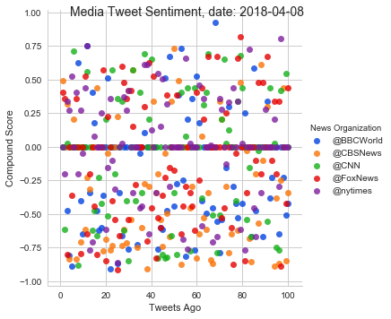
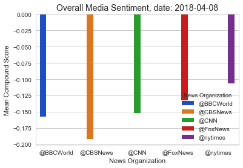

```python
import pandas as pd
import tweepy
import numpy as np
import matplotlib.pyplot as plt
plt.style.use("seaborn")
import seaborn as sns
import json
import datetime
from vaderSentiment.vaderSentiment import SentimentIntensityAnalyzer
analyzer = SentimentIntensityAnalyzer()

from config import (consumer_key, consumer_secret, 
                    access_token, access_token_secret)

# Setup Tweepy API Authentication
auth = tweepy.OAuthHandler(consumer_key, consumer_secret)
auth.set_access_token(access_token, access_token_secret)
api = tweepy.API(auth, parser=tweepy.parsers.JSONParser())
```


```python
#Pull into a DataFrame the tweet's source acount, its text, its date, and its compound, 
#positive, neutral, and negative sentiment scores.

# Target User Accounts
target_user = ("@BBCWorld", "@CBSNews", "@CNN", "@FoxNews", "@nytimes")

# List for dictionaries of results
bar_aggrigate_data = {}
csv_data = {}


#lists to hold all the data
compound_list = []
positive_list = []
negative_list = []
neutral_list = []
username = []
tweet_text = []
tweet_time = []
tweets_ago = []

# Loop through each user

for user in target_user:

    oldest_tweet = None
    counter = 0


    # Loop through 5 pages of tweets (total 100 tweets)
    for x in range(5):

        # Get all tweets from user home feed
        public_tweets = api.user_timeline(user, page=x, result_type="recent", max_id=oldest_tweet)
        

        # Loop through all tweets
        for tweet in public_tweets:
            
            text = tweet["text"]
            time = tweet["created_at"]
            
            # Run Vader Analysis on each tweet
            results = analyzer.polarity_scores(tweet["text"])
            compound = results["compound"]
            pos = results["pos"]
            neu = results["neu"]
            neg = results["neg"]

            # Add each value to the appropriate list
            compound_list.append(compound)
            positive_list.append(pos)
            negative_list.append(neg)
            neutral_list.append(neu)
            username.append(user)
            tweet_text.append(text)
            tweet_time.append(time)
            
            #reassigning the oldest tweet
            tweet_id = tweet["id"]
            oldest_tweet = tweet_id - 1
        
            # Increase counter by 1
            counter += 1


    # Create a dictionaty of results
    tweet_number = np.arange(1,101).tolist()
    tweets_ago = tweets_ago + tweet_number
    user_aggrigate = {user: np.mean(compound_list)}
    csv_results = {"News Organization": username,
                  "Tweet": tweet_text,
                  "Tweet Time": tweet_time,
                  "Compound Score": compound_list,
                  "Positive Score": positive_list,
                  "Neutral Score": neutral_list,
                  "Negative Score": negative_list,
                  "Tweets Ago": tweets_ago}

    # Append dictionary to list
    bar_aggrigate_data.update(user_aggrigate)
    csv_data.update(csv_results)
    
    # Print the Averages
    print(f"User: {user}")
    print(f"Compound: {np.mean(compound_list):.3f}")
```

    User: @BBCWorld
    Compound: -0.157
    User: @CBSNews
    Compound: -0.192
    User: @CNN
    Compound: -0.152
    User: @FoxNews
    Compound: -0.133
    User: @nytimes
    Compound: -0.107


```python
csv_df = pd.DataFrame.from_dict(csv_data)

csv_df.to_csv('tweet_results.csv')

csv_df.head()
```


<div>
<style scoped>
    .dataframe tbody tr th:only-of-type {
        vertical-align: middle;
    }

    .dataframe tbody tr th {
        vertical-align: top;
    }

    .dataframe thead th {
        text-align: right;
    }
</style>
<table border="1" class="dataframe">
  <thead>
    <tr style="text-align: right;">
      <th></th>
      <th>Compound Score</th>
      <th>Negative Score</th>
      <th>Neutral Score</th>
      <th>News Organization</th>
      <th>Positive Score</th>
      <th>Tweet</th>
      <th>Tweet Time</th>
      <th>Tweets Ago</th>
    </tr>
  </thead>
  <tbody>
    <tr>
      <th>0</th>
      <td>0.0000</td>
      <td>0.000</td>
      <td>1.000</td>
      <td>@BBCWorld</td>
      <td>0.0</td>
      <td>North Korea: Runners take part in Pyongyang's ...</td>
      <td>Sun Apr 08 16:42:02 +0000 2018</td>
      <td>1</td>
    </tr>
    <tr>
      <th>1</th>
      <td>0.0000</td>
      <td>0.000</td>
      <td>1.000</td>
      <td>@BBCWorld</td>
      <td>0.0</td>
      <td>RT @BBC_HaveYourSay: Are you coming to Windsor...</td>
      <td>Sun Apr 08 15:52:04 +0000 2018</td>
      <td>2</td>
    </tr>
    <tr>
      <th>2</th>
      <td>-0.4767</td>
      <td>0.279</td>
      <td>0.721</td>
      <td>@BBCWorld</td>
      <td>0.0</td>
      <td>Police foil Berlin half-marathon knife attack ...</td>
      <td>Sun Apr 08 15:44:22 +0000 2018</td>
      <td>3</td>
    </tr>
    <tr>
      <th>3</th>
      <td>-0.8074</td>
      <td>0.675</td>
      <td>0.325</td>
      <td>@BBCWorld</td>
      <td>0.0</td>
      <td>Trump condemns Syria suspected chemical attack...</td>
      <td>Sun Apr 08 13:38:00 +0000 2018</td>
      <td>4</td>
    </tr>
    <tr>
      <th>4</th>
      <td>-0.8860</td>
      <td>0.634</td>
      <td>0.366</td>
      <td>@BBCWorld</td>
      <td>0.0</td>
      <td>Canada crash: Country mourns Humboldt Broncos ...</td>
      <td>Sun Apr 08 13:12:29 +0000 2018</td>
      <td>5</td>
    </tr>
  </tbody>
</table>
</div>


```python
colors = ["blue", "orange", "green","red","purple"]
sns.palplot(sns.xkcd_palette(colors))
news_colors = sns.xkcd_palette(colors)
```


```python
sns.set_style("whitegrid", {'axes.grid' : True})
tweet_results_plot = sns.lmplot(x="Tweets Ago", y="Compound Score", hue='News Organization', 
                                data=csv_df, fit_reg=False, palette=news_colors, scatter_kws={"edgecolor": "black"})

# Accessing the figure to add a title, adding a title 
today = datetime.date.today()
tweet_results_plot.fig.suptitle(f'Media Tweet Sentiment, date: {today}', fontsize=14)
tweet_results_plot.savefig("tweet_scatter.png")
```





```python
# Creating a Dataframe for the agrigate compound scores
aggrigate_results_df = pd.DataFrame.from_dict(bar_aggrigate_data, orient="index")
aggrigate_results_df.reset_index(level=0, inplace=True)
aggrigate_results_df = aggrigate_results_df.rename(columns={0: "Mean Compound Score", "index": "News Organization"})
aggrigate_results_df.head()
```


<div>
<style scoped>
    .dataframe tbody tr th:only-of-type {
        vertical-align: middle;
    }

    .dataframe tbody tr th {
        vertical-align: top;
    }

    .dataframe thead th {
        text-align: right;
    }
</style>
<table border="1" class="dataframe">
  <thead>
    <tr style="text-align: right;">
      <th></th>
      <th>News Organization</th>
      <th>Mean Compound Score</th>
    </tr>
  </thead>
  <tbody>
    <tr>
      <th>0</th>
      <td>@BBCWorld</td>
      <td>-0.157101</td>
    </tr>
    <tr>
      <th>1</th>
      <td>@CBSNews</td>
      <td>-0.192032</td>
    </tr>
    <tr>
      <th>2</th>
      <td>@CNN</td>
      <td>-0.152107</td>
    </tr>
    <tr>
      <th>3</th>
      <td>@FoxNews</td>
      <td>-0.132625</td>
    </tr>
    <tr>
      <th>4</th>
      <td>@nytimes</td>
      <td>-0.106581</td>
    </tr>
  </tbody>
</table>
</div>


```python
#Bar plot for overall sentiment
bar_plot = sns.barplot(x="News Organization", y="Mean Compound Score", hue="News Organization", 
                       data=aggrigate_results_df, palette=news_colors)

bar_plot.axes.set_title(f'Overall Media Sentiment, date: {today}', fontsize=14)

```


    Text(0.5,1,'Overall Media Sentiment, date: 2018-04-08')




